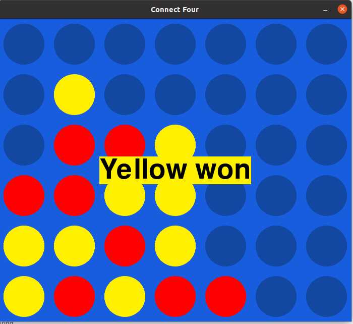

# Connect Four game in Python

Simple Python 3 Connect Four game using the `pygame` library

## Playing

First player is chosen randomly, clicking on one column will place a disc if possible. If win/draw occurs, a message is displayed, clicking again restarts the game

These actions can also be performed programmatically using the corresponding functions

## Screenshot

